# Weed-Detection-and-Spraying-Using-GPS-Guided-Drone-
GPS-guided autonomous drone for real-time weed detection and precision spraying. Uses YOLOv5-s for weed detection, Raspberry Pi 4B, Pixhawk, Pi Camera, and PyMAVLink for autonomous flight and GPS localization. Integrates RTSP streaming, Flask, FFmpeg, and GPIO control for remote monitoring and automated spraying.

> Status: working prototype. The detection model needs further training, and the final step of automatically commanding the Pixhawk to fly to the weed is still in progress.

## Features

- Real-time weed detection on a live **RTSP** stream from a Pi Camera
- Robust frame decoding with **FFmpeg** (handles stream dropouts better than plain OpenCV capture)
- Camera-calibrated conversion from bounding box → millimetres → **GPS coordinates**
- Compensation for the physical **camera and sprayer offsets** on the drone body
- Remote **GPIO control** of the sprayer over the network using `pigpio`
- Live **MAVLink telemetry** from the Pixhawk relayed to the detection environment through a Flask REST API

## Hardware

| Component | Purpose |
|---|---|
| Raspberry Pi 4 | Onboard computer: camera streaming, MAVLink relay, GPIO |
| Pixhawk flight controller | Flight control and telemetry |
| Pi Camera | Video source for detection |
| Drone frame + ESCs + motors | Airframe |
| GPS module | Drone positioning |
| Sprayer module with SRD-05VDC-3L-C relay | Switched by a Pi GPIO pin |

## Software Stack

| Tool | Purpose |
|---|---|
| YOLOv5 (v5s) | Weed detection |
| FFmpeg | RTSP stream decoding |
| OpenCV, NumPy, PyTorch | Image processing, maths, inference |
| MediaMTX | RTSP server on the Pi |
| Flask | Exposes GPS data to the detection environment over HTTP |
| PyMAVLink / MAVProxy | Communication with the Pixhawk |
| pigpio | Remote GPIO control |
| Docker | Runs the Colab notebook on a local runtime |

## System Architecture

```mermaid
flowchart LR
    A[Pi Camera] --> B["MediaMTX RTSP server (Pi)"]
    B --> C["FFmpeg decoding (laptop / Docker)"]
    C --> D[YOLOv5 detection]
    D --> E["Bounding box to world coordinates"]
    E --> F["World coordinates to GPS"]
    F --> G["Flask API on Pi"]
    G --> H["MAVLink to Pixhawk"]
    H --> I["Drone flies and positions sprayer"]
    I --> J["Pi sends GPS to Docker via HTTP / UDP"]
    J --> K["GPIO activated when target reached"]
```

## Training the YOLOv5 Model

**Dataset:** [Weed Detection on Kaggle](https://www.kaggle.com/datasets/jaidalmotra/weed-detection)

| Split | Images |
|---|---|
| Train | 4,002 |
| Validation | 381 |
| Test | 191 |
| **Total** | **4,574** |

- The original dataset labels several weed types. Since only *weed vs. not weed* is needed here, **all labels were merged into a single class: `weed`**.
- A **YOLOv5s** model was trained on the 4,002 training images in Google Colab running on a **local runtime (Docker)** with an **NVIDIA GeForce RTX 3050 Laptop GPU**.
- The best weights from training (`best.pt`) are used for detection.

---

## Results

Training ran for **20 epochs**. Approximate final values read from the plots:

| Metric | Value |
|---|---|
| mAP@0.5 | **0.82** |
| mAP@0.5:0.95 | ~0.40 |
| Precision | ~0.80 |
| Recall | ~0.77 |

The Precision-Confidence curve reaches precision 1.00 at a confidence threshold of 0.861.
> Further training and tuning of the model are needed to improve performance, especially on the stricter mAP@0.5:0.95 metric.

## Setup Guide

### 1. Raspberry Pi and camera stream

1. Flash the SD card with the recommended image from **Raspberry Pi Imager**.
2. If SSH is unavailable, set up **VNC** (using an HDMI monitor, USB keyboard and mouse for the first setup) and connect from a laptop with **RealVNC** over Wi-Fi.
3. Start the camera stream using the `rpicam-apps` commands from the [official documentation](https://www.raspberrypi.com/documentation/computers/camera_software.html#rpicam-apps).
4. Run **MediaMTX** (`mediamtx_v1.12.0_linux_arm64v8`) to serve the stream over **RTSP** on port `8554`. If MediaMTX runs in Docker, publish the port with `-p 8554:8554`.

> **Why RTSP?** A plain UDP stream did not work on the laptop, and WebRTC (HTTP) worked but RTSP gave better quality and speed, so RTSP was chosen.

### 2. Running detection on the RTSP stream

YOLOv5's default stream handling uses OpenCV, which is not robust to stream dropouts or reconnection. A **custom FFmpeg pipeline** is used in `detect.py` to decode frames from the RTSP stream instead.

### 3. Remote GPIO with pigpio

Start the pigpio daemon on the Pi so the laptop can control GPIO over TCP on port `8890`:

```bash
sudo systemctl enable pigpiod
sudo killall pigpiod
sudo pigpiod -p 8890 -n localhost -n <LAPTOP_IP>
```

A test GUI (`pigpio` + `tkinter`) with **Turn On**, **Turn Off** and **Close** buttons was used to verify the setup. A custom function in `detect.py` turns the sprayer on when the drone reaches the target coordinates.

### 4. Pixhawk ↔ Raspberry Pi over UART

| Raspberry Pi | Pixhawk (TELEM2) |
|---|---|
| TX (GPIO14 / Pin 8) | RX |
| RX (GPIO15 / Pin 10) | TX |
| GND | GND |

In **Mission Planner**, configure `SERIAL2` on the Pixhawk for **MAVLink 2** with a baud rate of **921600**.

Relay MAVLink from the Pi to the laptop with MAVProxy:

```bash
mkdir -p /home/pi/mavproxy_logs
sudo /home/pi/myenv/bin/mavproxy.py \
  --master=/dev/ttyAMA0 --baudrate 921600 \
  --log /home/pi/mavproxy_logs/mav.tlog \
  --out=<LAPTOP_IP>:14552
```

- `--master` sets the serial port and baud rate for incoming MAVLink messages.
- `--out` forwards all MAVLink messages by UDP to the laptop on port `14552` (a typical GCS port).
- `~/myenv` is the Python virtual environment where MAVProxy is installed.

### 5. Streaming GPS to the Docker container

Docker could not receive the UDP MAVLink stream directly, so a small **Flask** server on the laptop:

- listens for MAVLink GPS messages (`pymavlink.mavutil`) in a background thread (`threading`),
- exposes the latest position as JSON at the **`/gps`** endpoint (`jsonify`).

`detect.py` then polls this endpoint using the `requests` library.

---

## How Detection Becomes a GPS Target

1. **Camera calibration:** the camera matrix and distortion coefficients (`camera_matrix`, `dist_coeffs`) are computed with OpenCV and a printed checkerboard ([tutorial](https://medium.com/@amit25173/opencv-camera-calibration-03d19f0f52bc)) and stored in a `.npz` file.
2. **Scale:** the focal length `f_x` from the camera matrix and the drone altitude `alt0` (assumed to be in **millimetres**) give the millimetres-per-pixel scale using a simple pinhole model.
3. **Bounding box → pixels:** the normalised YOLO box centre and size are converted to pixel coordinates.
4. **Undistortion:** the pixel point goes through `cv2.undistortPoints()` to remove lens distortion, then is scaled to millimetres with `mm_per_pixel`.
5. **Offsets:** the camera and sprayer are not at the drone's centre, so their offsets in the drone body frame are applied:

```python
sprayer_offset = np.array([-127.28, 127.28, 0])
cam_offset     = np.array([0, -130, 0])
weed_in_cam    = np.array([x_mm, y_mm, 0])
weed_in_drone  = cam_offset + weed_in_cam
sprayer_to_weed = weed_in_drone - sprayer_offset
```

6. **To GPS:** using the drone's current position (`lat0`, `lon0`), `offset_to_gps()` converts the millimetre offset into a new latitude/longitude (`weed_lat`, `weed_lon`), taking the Earth's curvature into account.
7. **Send:** the target coordinates are streamed to the Pi over HTTP with `requests`, and the Pi passes them to the Pixhawk.

## Sprayer Activation Logic

A custom loop compares the drone's live position with the target weed coordinates using the **haversine formula**:

- If the drone is within **0.5 m** of the weed **and** at an altitude of **70 cm or lower**, the target is considered reached.
- The GPIO function turns the sprayer on and the `reached` flag is set to `True`, which exits the loop.
- Connectivity and parsing errors are caught and retried after a short delay.
- Detection pauses until the drone has aligned and sprayed, then continues with the next detection. The whole sequence runs inside a loop over every detection in the frame.
